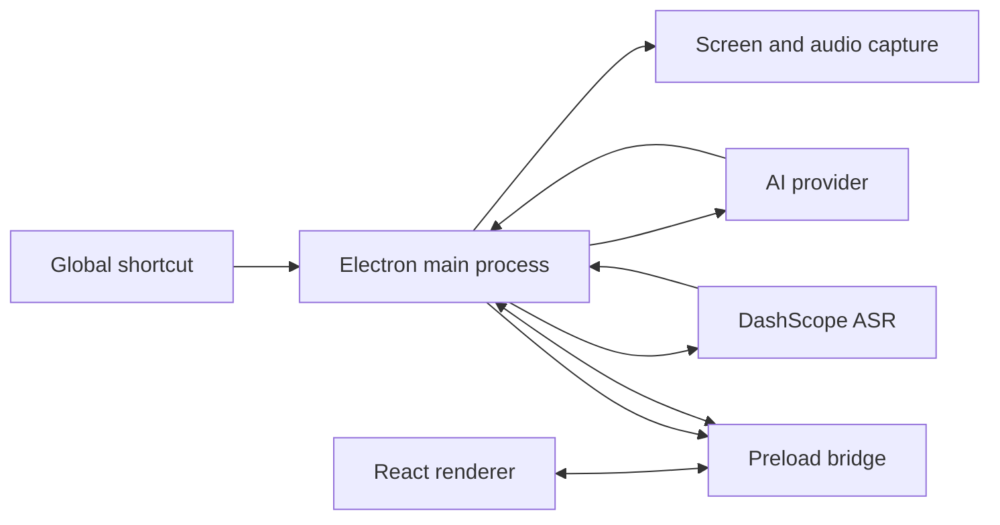

<div align="center">
  
  <h1>Penumbra</h1>
  <p><strong>A compact desktop AI workspace for visual analysis, live transcription, and interview practice.</strong></p>

  <p>
    <a href="https://github.com/seihn2/penumbra/actions/workflows/ci.yml"></a>
    <a href="https://creativecommons.org/licenses/by-nc/4.0/"></a>
    
    
    
  </p>
</div>

Penumbra is a source-available Electron application that combines screenshot analysis, streaming AI
answers, real-time speech transcription, and a compact always-on-top overlay. It supports
OpenAI-compatible APIs and the Anthropic Messages API, stores credentials with Electron
`safeStorage`, and offers interfaces in English, Simplified Chinese, Japanese, Korean, and French.

> [!IMPORTANT]
> Penumbra is intended for practice, accessibility, note-taking, and workflows where assistance is
> explicitly allowed. Follow the rules of your interviewer, employer, school, and local law. Screen
> capture protection and 0 UI mode reduce on-screen and software-capture exposure; they cannot make
> a visible display invisible to a physical camera.

## Overview

Penumbra turns a desktop overlay into a focused AI workspace:

- Capture one or more screenshots and stream a structured answer from a vision-capable model.
- Transcribe microphone and system audio as separate speakers with DashScope real-time ASR.
- Generate contextual answer cues, translations, summaries, and conversation timelines.
- Keep the window always on top, adjust its opacity, enable mouse passthrough, or switch to an
  ultra-compact plaintext-only 0 UI mode.
- Index local projects and attach personal reference material for context-aware answers.
- Preserve conversations locally and export them as Markdown.

Penumbra is currently distributed primarily from source. The repository does not promise an
official installer for every commit; use the packaging commands below when you need a local DMG,
NSIS installer, AppImage, Snap, or Debian package.

## Installation

### Requirements

- [Node.js 22](https://nodejs.org/) and npm
- macOS, Windows, or Linux
- An API key for an OpenAI-compatible or Anthropic model provider
- Optional: a [DashScope API key](https://help.aliyun.com/zh/model-studio/get-api-key) for live
  transcription

### Run from source

```bash
git clone https://github.com/seihn2/penumbra.git
cd penumbra
npm ci
npm run dev
```

Use `npm ci` for a reproducible install based on `package-lock.json`. On first launch, open
**Settings**, add an answer-service profile, and configure its API endpoint, API key, and model.

### Build a local desktop package

```bash
# macOS: DMG and ZIP
npm run build:mac

# Windows: NSIS installer
npm run build:win

# Linux: AppImage, Snap, and DEB
npm run build:linux
```

Generated packages are written to `dist/`. Packaging is platform-dependent; for the most reliable
results, build on the target operating system.

## Quick Start

1. Start Penumbra with `npm run dev` or open your locally packaged application.
2. In **Settings → Models**, create an answer-service profile.
3. Select either an OpenAI-compatible endpoint or the Anthropic Messages API, then provide the
   base URL, API key, and model name.
4. Press `Alt+Enter` to capture the screen and start an answer. Use `Alt+Shift+Enter` to append
   another screenshot to the same request.
5. Optional: add a DashScope key under transcription settings, then press
   `Command/Ctrl+Shift+T` to start or pause live transcription.
6. Press `Alt+Shift+H` whenever you want to enter or leave 0 UI mode.

Choose a model that accepts image input for screenshot analysis. You can change the code language,
prompt, answer style, shortcuts, opacity, and privacy behavior from Settings.

## Commands

| Command                | Purpose                                             |
| ---------------------- | --------------------------------------------------- |
| `npm run dev`          | Start Electron in development mode with hot reload. |
| `npm start`            | Preview the production build.                       |
| `npm run lint`         | Run ESLint.                                         |
| `npm run format`       | Format the repository with Prettier.                |
| `npm run typecheck`    | Type-check the main/preload and renderer projects.  |
| `npm test`             | Run the Vitest suite once.                          |
| `npm run test:watch`   | Run Vitest in watch mode.                           |
| `npm run build`        | Type-check and create a production Electron build.  |
| `npm run preflight`    | Validate release prerequisites and metadata.        |
| `npm run build:unpack` | Produce an unpacked application directory.          |
| `npm run build:mac`    | Build macOS packages.                               |
| `npm run build:win`    | Build the Windows installer.                        |
| `npm run build:linux`  | Build Linux packages.                               |

## Configuration

Application settings are persisted locally. Secrets are sent to the Electron main process for
encrypted storage through `safeStorage`; raw answer-service API keys are not stored in browser
`localStorage`.

The following environment variables can seed development defaults:

| Variable            | Required                | Description                                                            |
| ------------------- | ----------------------- | ---------------------------------------------------------------------- |
| `API_BASE_URL`      | Yes for seeded AI setup | Base URL for an OpenAI-compatible endpoint.                            |
| `API_KEY`           | Yes for seeded AI setup | Answer-service API key.                                                |
| `MODEL`             | No                      | Default answer model identifier.                                       |
| `CODE_LANGUAGE`     | No                      | Default programming language for generated code.                       |
| `DASHSCOPE_API_KEY` | No                      | DashScope key used by live transcription.                              |
| `ASR_MODEL`         | No                      | DashScope ASR model; defaults to `qwen-audio-3.0-asr-flash-streaming`. |

Example `.env` file:

```dotenv
API_BASE_URL="https://openrouter.ai/api/v1"
API_KEY="replace-with-your-key"
MODEL="replace-with-a-vision-capable-model"
CODE_LANGUAGE="typescript"
DASHSCOPE_API_KEY="replace-with-your-dashscope-key"
ASR_MODEL="qwen-audio-3.0-asr-flash-streaming"
```

Do not commit `.env` files or credentials. Values saved in the application take precedence where
the corresponding setting is available.

## Key Features

### Screenshot analysis

- Global capture shortcuts with streamed model output.
- Multi-image requests and follow-up questions in the same conversation.
- Coding-oriented responses with implementation, complexity, and edge-case guidance.
- General-purpose prompts for non-coding visual questions.
- Conversation history, restore, and Markdown export.

### Live transcription and coaching

- Independent microphone and system-audio streams for speaker separation.
- Real-time DashScope ASR over WebSocket with reconnect handling.
- Question detection and debounced, contextual answer cues.
- Optional proactive coaching, inline translation, topic summaries, timelines, and speaking-ratio
  statistics.
- Markdown export for review after a permitted practice session or meeting.

### Context and customization

- Reusable model profiles for OpenAI-compatible and Anthropic providers.
- Personal context from resumes or reference documents, including PDF import.
- Local project indexing for code-aware context.
- Custom prompts, answer modes, programming languages, and appearance controls.
- Five interface languages: English, Simplified Chinese, Japanese, Korean, and French.

## 0 UI Mode

0 UI mode is designed for situations where the usable overlay must be extremely small, especially
when a second physical camera can see the display. It removes the normal chat interface instead of
merely making it transparent.

When enabled:

- Only assistant text is rendered, as compact literal plaintext.
- Toolbars, message chrome, user messages, screenshot thumbnails, and ordinary chat layout are
  bypassed completely.
- The window can be reduced to **200 × 120 pixels**.
- UI text can be reduced to **9 px** and answer text to **8 px**.
- A light-background or dark-background preset can be selected independently so the text and
  surface blend more naturally with the content behind the overlay.
- `Alt+Shift+H` toggles the mode globally, even when Penumbra is not focused.

For a two-camera setup, calibrate both presets before the session: open the actual light and dark
content you expect to use, place the overlay in a low-attention area, reduce its dimensions and
opacity only until the text remains readable, and verify the result from the second camera's real
angle and exposure. Camera auto-exposure, moiré, glare, viewing angle, and display brightness can
make a subtle overlay much more visible than it appears head-on.

0 UI mode is a visibility-minimization tool, not physical concealment. Anything visible on a monitor
can be recorded by a camera pointed at that monitor.

## Default Shortcuts

`Alt` is labeled `Option` on macOS. Shortcuts can be changed in **Settings → Shortcuts**.

| Action                                 | Default shortcut                    |
| -------------------------------------- | ----------------------------------- |
| Capture screenshot and start an answer | `Alt+Enter`                         |
| Append another screenshot              | `Alt+Shift+Enter`                   |
| Stop the current AI response           | `Alt+.`                             |
| Toggle 0 UI mode                       | `Alt+Shift+H`                       |
| Show or hide the window                | `Alt+H`                             |
| Reset window position and size         | `Alt+0`                             |
| Toggle mouse passthrough               | `Alt+M`                             |
| Start a new conversation               | `Alt+Shift+N`                       |
| Focus the composer                     | `Alt+I`                             |
| Toggle content protection              | `Alt+Shift+S`                       |
| Toggle the macOS Dock icon             | `Alt+Shift+D`                       |
| Increase/decrease overall opacity      | `Alt+=` / `Alt+-`                   |
| Increase/decrease window opacity       | `Alt+]` / `Alt+[`                   |
| Increase/decrease text opacity         | `Alt+Shift+]` / `Alt+Shift+[`       |
| Increase/decrease icon opacity         | `Alt+Shift+=` / `Alt+Shift+-`       |
| Start or pause transcription           | `Command/Ctrl+Shift+T`              |
| Clear transcription                    | `Alt+Shift+T`                       |
| Copy the latest answer                 | `Alt+C`                             |
| Scroll the answer                      | `Command/Ctrl+J` / `Command/Ctrl+K` |
| Move the window                        | `Command/Ctrl+Arrow key`            |

Global shortcuts can conflict with operating-system or third-party bindings. If registration fails,
choose another combination in Settings.

## Architecture

Penumbra follows Electron's main/preload/renderer separation. Shared modules hold pure domain logic
and contracts used across process boundaries.

| Area         | Location        | Responsibility                                                                                  |
| ------------ | --------------- | ----------------------------------------------------------------------------------------------- |
| Main process | `src/main/`     | Windows, global shortcuts, encrypted settings, capture, AI streams, ASR, and IPC orchestration. |
| Preload      | `src/preload/`  | Narrow `contextBridge` API exposed to the renderer.                                             |
| Renderer     | `src/renderer/` | React UI, chat, settings, transcription views, and local interaction state.                     |
| Shared       | `src/shared/`   | Process-neutral contracts, validation, and reusable domain logic.                               |
| Tests        | `test/`         | Vitest contract, migration, domain, and integration-oriented tests.                             |



See [the architecture note](docs/architecture.md) and the focused documents in [`docs/`](docs/)
for deeper implementation details.

## Privacy and Security Boundaries

- Answer-service keys are encrypted by the Electron main process with `safeStorage` before local
  persistence when the platform supports it.
- The renderer communicates through an explicit preload bridge instead of receiving unrestricted
  Node.js access.
- Screenshots, prompts, and selected context are sent to the configured answer provider when you
  request an answer. Selected context can include transcript excerpts, imported personal material,
  and retrieved local-project evidence when those features are enabled.
- Live audio is sent to DashScope when real-time transcription is enabled. The resulting transcript
  can also be sent to the configured answer provider for coaching, translation, or summarization.
  Review the retention and privacy terms of every provider you configure.
- Content protection is enabled by default and asks the operating system to exclude the window from
  many software capture paths. Support varies by operating system, browser, meeting client, and
  capture method, so test the exact setup you rely on.
- Content protection does not affect physical cameras, external capture cards, or every possible
  capture implementation.

Do not treat Penumbra as a secure channel for secrets. Minimize the data you send to providers and
avoid attaching confidential material unless you are authorized to do so.

## Platform Permissions

### macOS screenshots, system audio, and screen recording

Screenshot analysis and system-audio capture require macOS Screen Recording permission:

1. Press `Alt+Enter` to request a screenshot, or start dual-source transcription, so macOS can
   display the permission request.
2. Open **System Settings → Privacy & Security → Screen Recording** and enable Penumbra.
3. Quit Penumbra completely and reopen it so the TCC permission is applied.

macOS 14.2 and later can provide native system-audio loopback; BlackHole is usually unnecessary.
Microphone capture requires the separate Microphone permission. macOS may show a system privacy
indicator while capture is active; applications cannot disable that indicator.

### Stable local signing on macOS

An unsigned or ad-hoc-signed build may receive a different identity after rebuilding, which can
invalidate previously granted permissions. The repository includes a helper for a stable local
development certificate:

```bash
bash scripts/create-signing-cert.sh
npm run build:mac
```

The post-package hook uses `Penumbra Local Signing` when available. If `CSC_LINK` or `CSC_NAME` is
configured for a real signing identity, the local signing path is skipped. Local signing is not
Apple notarization and is not suitable for public distribution by itself.

## Troubleshooting

### The window is missing or positioned off-screen

Press `Alt+0` to restore its default position and size, then use `Alt+H` to ensure it is visible.

### The window does not accept clicks

Mouse passthrough may be active. Press `Alt+M` to toggle it.

### Screenshot capture or system audio does not work on macOS

Confirm Screen Recording permission, quit the application completely, and launch it again. Also
check Microphone permission when microphone audio is missing.

### A shortcut does nothing

Another application may already own that global shortcut. Change it under **Settings → Shortcuts**
and restart Penumbra if the operating system does not release the old binding immediately.

### The overlay appears in a screen share

Confirm content protection is enabled, then test the same operating system, meeting application,
browser, and capture source that will be used. No application-level flag can guarantee exclusion
from every capture pipeline.

### Electron dependency downloads are slow or fail

Retry on a stable connection. If the default Electron distribution endpoint is unavailable in your
region, set an appropriate `ELECTRON_MIRROR` for your network before running `npm ci`.

## Contributing

Contributions are welcome for bug fixes, tests, documentation, accessibility, platform support, and
well-scoped features. Before opening a pull request:

```bash
npm ci
npm run lint
npm run typecheck
npm test
npm run build
```

Keep changes focused, add or update tests for behavior changes, and explain user-visible effects in
the pull request. Read [CONTRIBUTING.md](CONTRIBUTING.md) for the development workflow and review
checklist. Please use [GitHub Issues](https://github.com/seihn2/penumbra/issues) for reproducible bugs
and concrete feature proposals.

## Project Structure

```text
penumbra/
├── src/
│   ├── main/       Electron main process and services
│   ├── preload/    Secure renderer bridge
│   ├── renderer/   React application
│   └── shared/     Cross-process contracts and domain logic
├── test/           Vitest test suite
├── docs/           Architecture, verification, and platform notes
├── resources/      Application icons and packaged resources
├── scripts/        Release, signing, and maintenance scripts
└── electron-builder.yml
```

## Responsible Use

Penumbra does not grant permission to use AI assistance. Before using it in an interview, exam,
meeting, workplace, or recorded session, obtain any consent required by policy or law. Laws governing
audio recording and transcription vary by jurisdiction. You are responsible for notifying other
participants when required and for protecting personal or confidential information.

## License

Penumbra is licensed under
[Creative Commons Attribution-NonCommercial 4.0 International](https://creativecommons.org/licenses/by-nc/4.0/)
(`CC BY-NC 4.0`). You may use, share, and adapt the project with attribution for noncommercial
purposes. Commercial use requires separate written permission from the author. See [LICENSE](LICENSE)
for the repository's license text.

## Author

[seihn2](https://github.com/seihn2)

## Acknowledgements

Penumbra evolved from screenshot-oriented coding-assistant work by
[Gavin Wang](https://github.com/ooboqoo) and was also inspired by
[Interview Coder](https://github.com/ibttf/interview-coder). Thank you to the maintainers and
contributors whose work helped shape the project.
