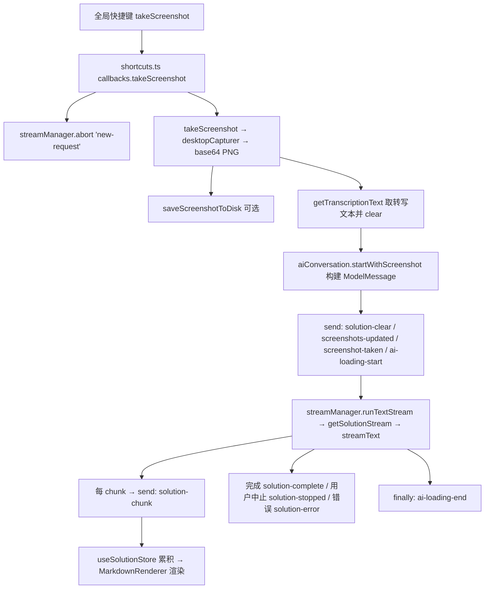
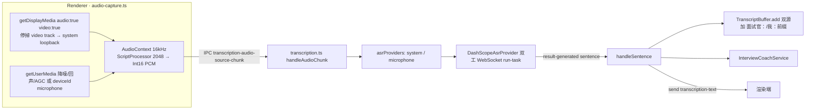

# Penumbra 架构文档

本文档面向贡献者，深入说明 Penumbra 的进程模型、关键数据流、状态管理与构建签名机制。功能层面的概述见 [README](../README.md)。

> 模块速览另见仓库根部的 `AGENTS.md`。本文以当前代码为准，若与 `AGENTS.md` 有出入以本文为准。

---

## 1. 进程模型

Electron 三进程：主进程（Node）、预加载（contextBridge 桥）、渲染进程（React）。

```
┌─────────────────────────────────────────────────────────────┐
│ Main 进程  src/main/                                          │
│  ┌──────────┐ ┌──────────┐ ┌───────────────────────────────┐ │
│  │settings  │ │ state    │ │ shortcuts.ts                  │ │
│  │.ts       │ │ .ts      │ │  全局快捷键 + 会话类 IPC      │ │
│  └────┬─────┘ └────┬─────┘ │  ↘ StreamManager              │ │
│       │            │       │  ↘ AiConversationService      │ │
│       │            │       │  ↘ window-controller          │ │
│       │            │       └──┬──────────────┬─────────────┘ │
│       │            │     ┌────┴───┐   ┌──────┴────────────┐  │
│       │            │     │ ai.ts  │   │ take-screenshot   │  │
│       │            │     └────────┘   └───────────────────┘  │
│       │            │     ┌──────────────────────────────────┐│
│       │            │     │ transcription.ts                 ││
│       │            │     │  ↘ asr/dashscope-provider (×2)   ││
│       │            │     │  ↘ transcript-buffer             ││
│       │            │     │  ↘ services/interview-coach      ││
│       └────────────┴─────┴──────────────────────────────────┘│
│                    IPC (ipcMain.handle / webContents.send)    │
├─────────────────────────────────────────────────────────────┤
│ Preload  src/preload/index.ts   contextBridge → window.api    │
├─────────────────────────────────────────────────────────────┤
│ Renderer  src/renderer/  React 19 + Zustand                   │
│  window.api.invoke*()  调用主进程                             │
│  window.api.on*()      订阅主进程推送事件                     │
└─────────────────────────────────────────────────────────────┘
```

### 主进程关键文件

| 文件 | 职责 |
|---|---|
| `index.ts` | 应用入口、生命周期、全局异常处理（吞掉流中止产生的 AbortError）；`session.setDisplayMediaRequestHandler` 强制系统音频 loopback；创建窗口。 |
| `main-window.ts` | 创建 `transparent` / `alwaysOnTop` / `skipTaskbar` 窗口；`ready-to-show` 强制 `setOpacity(1)+center()+show()`、`setVisibleOnAllWorkspaces`、`applyContentProtection`；`setWindowOpacity` IPC（不透明度下限 0.1）。 |
| `shortcuts.ts` | `globalShortcut` 注册 + 回调表；截图 / 文本 / 追问 / 重试 / 清空 / 恢复 / 停止等会话 IPC handler；委托 `StreamManager` 与 `AiConversationService`。 |
| `ai.ts` | Vercel AI SDK 封装：`getSolutionStream` / `getFollowUpStream` / `getGeneralStream`（`streamText`），以及 `streamInterviewAssist` / `streamProactiveAssist` / `summarizeConversation` / `translateTranscriptText` / `testAiConnection` / `fetchAvailableModels`。系统提示词从 `prompts.md` 运行时读取。 |
| `settings.ts` | `settings` 对象 + IPC CRUD；`applyDockVisibility`、`setContentProtection`、`safeStorage` 加密密钥。 |
| `state.ts` | 运行时状态（`inCoderPage`、`ignoreMouse`）+ `updateAppState` IPC。 |
| `transcription.ts` | ASR 协调层：两路 `DashScopeAsrProvider`（system / microphone）+ `TranscriptBuffer` + `InterviewCoachService`，所有转写 IPC。 |

> **历史注记**：`shortcuts.ts` 曾是 580+ 行的「巨型编排器」；AI 流式逻辑现已抽出到 `src/main/services/` 下的 `StreamManager`、`AiConversationService`、`window-controller`。

---

## 2. 截图 → 解题数据流



**流中止模式**：`StreamContext` 持有 `AbortController` 与 `reason`。新请求自动中止上一条流——`new-request` 静默处理，`user`（用户手动停止）则发 `solution-stopped`。追问走 `getFollowUpStream`，多截图续拍走 `getGeneralStream`。会话历史以 `ModelMessage[]` 维护。

---

## 3. ASR 实时转写管线（双音源）



### 双音源说话人区分
`transcription.ts` 启动两个独立的 `DashScopeAsrProvider`。`getProviderSpeaker()` 将 `system → interviewer`、`microphone → candidate`，标签作为 `providerSpeaker` 附到每个 sentence。`dualSourceTranscriptionEnabled` 开启时，`TranscriptBuffer` 给定稿行加 `面试官：` / `我：` 前缀。

> macOS 上 loopback 音频**必须**伴随一个屏幕视频源才能拿到（纯音频请求会 `AbortError`），故渲染端 `getDisplayMedia` 同时请求 video，拿到后立即 `stop()` 丢弃，只消费音频轨。

### TranscriptBuffer
纯/有状态、无 Electron 依赖（可单测，见 `test/transcript-buffer.test.ts`）。累积定稿文本 + 各音源进行中的 partial，上限 8000 字、在换行边界裁剪以免截断带标签的行。partial 替换上一条 partial 而非累加。

### DashScopeAsrProvider 自动重连
每个 provider 打开 `wss://dashscope.aliyuncs.com` 双工 WebSocket，发 `run-task`（16kHz PCM、`disfluency_removal_enabled`、可选 `language_hints`），再流式发送音频块。`result-generated` 事件携带 `sentence.text`，`isPartial = sentence.sentence_end !== true`。意外 `close`（非用户停止）时按指数退避 `500ms * 2^(n-1)` 重连，最多 3 次；干净的 `task-started` 重置退避。耗尽重试后报「语音识别连接已断开，请重试」。单路出错仅在无其他路运行时才发 `transcription-stopped`。

### InterviewCoachService（编排）
- **提问触发实时辅助**：定稿的面试官轮次累积到 `pendingQuestion`，仅当 `looksLikeQuestion()` 为真才按 `assistDebounceMs`（默认 1500ms，夹取 200–10000）防抖触发，流式 `streamInterviewAssist`；更新的问题会中止在途请求。`requestAssistNow()`（IPC `request-interview-assist`）绕过防抖手动触发。受 `realtimeAssistEnabled` 控制。
- **主动陪聊**：`PROACTIVE_INTERVAL_MS = 20000` 定时器（随转写启停），由纯函数 `shouldRunProactiveAssist()` 把关——仅在启用、无在途辅助（与提问辅助共享 `assistInFlight` 标志，互不重叠）、有新定稿轮次且有内容时才跑。受 `proactiveAssistEnabled` 控制。
- **话题摘要**：每 `SUMMARY_INTERVAL_TURNS = 6` 个定稿轮次刷新一次 `summarizeConversation`，经 `interview-summary` 推送。
- **实时翻译**：仅对定稿句（非 partial）调用 `translateTranscriptText` 翻到 `translationTargetLanguage`，控制成本与延迟。
- 上下文经 `buildTranscriptContext`（取最近若干轮，每轮限长）构建。

### 纯领域逻辑（`src/shared/`）
`interview-coach.ts` 的 `analyzeTranscriptTurn()` 是对 `InterviewCoachState` 的纯 reducer：检测语言（按 kana → hangul → Han → 拉丁字母顺序，避免日文被误判为中文）、推断说话人（`providerSpeaker` 优先，否则关键词启发式，再否则 `unknown`）、推断面试阶段（greeting / clarifying / coding / reviewing / closing 等）。partial 轮次替换上一条 partial，历史上限 `MAX_TURNS = 100`，置信度随「已知 + provider 标注」轮次占比上升。`looksLikeQuestion()` 用多语言疑问线索（中/英/日/韩/法）识别问句、过滤填充语以省 token。这些纯函数均有 Vitest 覆盖。

---

## 4. 状态管理（Zustand）

| Store | 文件 | 持久化 | 关键 state |
|---|---|---|---|
| `useAppStore` | `store/app.ts` | 否 | `ignoreMouse` |
| `useSettingsStore` | `store/settings.ts` | **是 · v15** · `interview-coder-settings` | API 配置、三层不透明度、`uiLanguage`、`userMemory`、全部 ASR/教练开关、`contentProtectionEnabled` 等 |
| `useShortcutsStore` | `store/shortcuts.ts` | **是 · v7** · `interview-coder-shortcuts` | `shortcuts`（action → key + 注册状态） |
| `useSolutionStore` | `store/solution.ts` | 否 | `isLoading`、`solutionChunks`、`screenshotData`、`errorMessage` |
| `useChatStore` | `store/chat.ts` | **是 · v1** · `penumbra-chat-history` | `messages`（实时）、`history`（归档、剥离 base64）、`seq` |
| `useTranscriptionStore` | `store/transcription.ts` | 否 | `isTranscribing`、`transcriptionText`、`translations`、`interviewCoach`、`assists`、`liveAssist`、`assistLoading`、`summary`、`errorMessage` |

**设置同步**：渲染端持久化到 localStorage，挂载时通过 `updateAppSettings()` 同步给主进程；`.env` 仅作初始默认值。

**持久化加固**：`settings` store 的 `migrate` 调用纯函数 `sanitizePersistedSettings()`——只保留类型匹配默认值的已知键、合并到默认值上、永不抛错（损坏的持久化状态不能让渲染崩溃，否则透明窗口会变成完全不可见）。v15 迁移会把旧值里被关掉的 `contentProtectionEnabled` 强制重置为 `true`（隐身是核心能力）。

**密钥安全**：`apiKey` / `dashscopeApiKey` **不写入 localStorage**，由主进程 `safeStorage` 加密存储，渲染端挂载时再水合。

---

## 5. 隐身与窗口机制

均位于 `main-window.ts`（鼠标穿透在 `window-controller.ts`）：

- **窗口选项**：`transparent:true`、`alwaysOnTop:true`、`skipTaskbar:true`、`hiddenInMissionControl:true`；macOS `titleBarStyle:'hidden'`（保留交通灯），其他平台 `frame:false`。
- **截屏隐身**：`applyContentProtection()` → `setContentProtection(settings.contentProtectionEnabled !== false)`；改设置时同步重设。
- **跨工作区 / 全屏可见**：`setVisibleOnAllWorkspaces(true, { visibleOnFullScreen:true, skipTransformProcessType:true })` + `setAlwaysOnTop(true, 'screen-saver', 1)`，并监听 `always-on-top-changed` 重新夺回置顶。
- **鼠标穿透**：`setIgnoreMouseEvents(true, { forward:true })`——点击穿透到下层，move 事件仍转发以支持 hover。
- **防误置黑窗**：不透明度下限 0.1（`clampOpacity`），启动强制 `setOpacity(1)+center()`，`resetWindow`（`Alt+0`）一键恢复。

> 透明窗口意味着任何渲染层崩溃都会表现为「整窗不可见」，因此渲染入口包了 ErrorBoundary，持久化层也做了上述加固。

---

## 6. 构建与 macOS 签名

`electron-vite`（Vite 7）构建 → `electron-builder` 25 打包。`prompts.md` 经 `vite-plugin-static-copy` 拷到产物，运行时 `readFileSync(join(import.meta.dirname,'prompts.md'))` 读取。

### afterPack 签名钩子（`scripts/after-pack-mac-sign.cjs`，仅 macOS）

**问题背景**：无 Apple 开发者身份时，electron-builder 的 ad-hoc 签名会把 code-signing **identifier** 留为 "Electron"（继承自框架）。macOS TCC 按 **identifier**（而非 bundle id）记录「屏幕录制 / 麦克风」授权——"Electron" 标识会与其他所有 ad-hoc Electron 应用冲突，授权永远记不住，表现为 `getDisplayMedia` loopback 反复 `NotAllowedError`。更糟的是 ad-hoc 签名哈希**每次打包都变**，即便修正了 identifier，每次重打包也会被当作新应用、授权丢失。

**修复**：
1. **稳定身份优先**：`scripts/create-signing-cert.sh` 一次性在登录钥匙串创建自签名代码签名证书 `Penumbra Local Signing`。钩子检测到它就用它签名，使签名哈希在重打包间保持稳定 → 授权持久。未安装时回退 ad-hoc（应用仍可运行、仍隐身，仅授权不跨重打包保留）。
2. **由内向外重签**：先 `Contents/Frameworks` 内的 helper app，再顶层 app，`--identifier com.penumbra.app` + `--entitlements build/entitlements.mac.plist`（含 `audio-input` / `microphone`）。
3. **不加 `--options runtime`**：ad-hoc / 自签名 + 强化运行时会被 AMFI 拒绝加载，产生「应用已损坏，无法打开」。
4. **校验**：`codesign -dvv` 确认 identifier 生效，否则抛错终止构建。
5. 配置了真实签名身份（`CSC_LINK` / `CSC_NAME`）时整段跳过。

**配套 Info.plist**：`electron-builder.yml` 的 `extendInfo` 以 **map** 形式设置 `NSAudioCaptureUsageDescription`（macOS 14.2+ 采集系统音频必需，缺失会导致音频流静默失效）。

---

## 7. 测试

`src/shared/` 下的纯函数（转写缓冲、面试教练分析、统计、上下文构建、问句识别、设置清洗等）均有 Vitest 单元测试，共约 200 项。运行：

```bash
npm test          # 单次运行
npm run test:watch
```

设计原则：把可测的领域逻辑抽到无副作用的纯函数中，UI 与 Electron 集成层保持薄。
