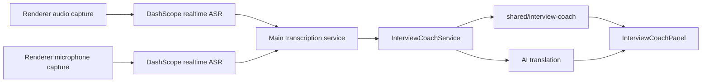

# Interview Coach Architecture

This module turns realtime ASR output into an interview-practice coaching stream.
It is designed for mock interviews, practice sessions, and post-interview review.

## Scope

- Realtime transcript display from the existing DashScope Fun-ASR stream.
- Interview stage detection: greeting, questioning, clarifying, answering, coding, reviewing, closing.
- Speaker role inference for interviewer/candidate.
- Dual-source speaker separation: system audio can be labeled as interviewer and microphone audio as candidate.
- AI translation for finalized ASR sentences.
- Lightweight answer suggestions for practice and structured communication.

This module does not implement or improve proctoring bypass behavior.

## Current Pipeline



## Important Files

- `src/main/transcription.ts`: orchestration layer for renderer IPC, transcript text aggregation, and coach events.
- `src/main/asr/types.ts`: provider contract for realtime ASR sentence events.
- `src/main/asr/dashscope-provider.ts`: current DashScope Fun-ASR WebSocket implementation.
- `src/main/services/interview-coach-service.ts`: owns coach state updates and final-sentence translation.
- `src/renderer/src/lib/audio-capture.ts`: captures system audio and, optionally, microphone audio as independent sources.
- `src/shared/interview-coach.ts`: pure domain model and heuristic analyzer.
- `src/renderer/src/coder/interview/InterviewCoachPanel.tsx`: realtime coaching UI.
- `src/renderer/src/lib/store/transcription.ts`: renderer-side transcript, translation, and coach state.

## Speaker Separation Strategy

The domain model supports two speaker sources:

1. `provider`: a future ASR provider returns speaker labels directly.
2. `heuristic`: the current fallback infers speaker role from question/answer language patterns.

DashScope `fun-asr-realtime` output in the current integration does not provide reliable per-speaker diarization metadata, so the current behavior is explicitly heuristic. To add true diarization, implement an `AsrProvider` that emits `providerSpeaker` into `InterviewCoachService.handleSentence()`.

The app exposes `speakerDiarizationMode`:

- `heuristic`: use language-pattern inference when no upstream speaker label exists.
- `provider`: intended for future single-stream ASR providers with true diarization labels.

The app also exposes `dualSourceTranscriptionEnabled`. When enabled, it opens two realtime ASR streams:

- `system` source: captured from screen/system audio and labeled as `interviewer`.
- `microphone` source: captured from `getUserMedia()` and labeled as `candidate`.

This is more reliable than text-only heuristics when the candidate uses a local microphone and the interviewer audio arrives through system audio. It is not the same as single-channel acoustic diarization; if both people are mixed into one audio stream, a diarization-capable ASR provider is still required.

Dual-source labels are treated as upstream speaker labels because the source itself identifies the role. Therefore, system/microphone labels are honored regardless of the selected `speakerDiarizationMode`; the mode remains useful for future single-stream providers.

## Translation Strategy

AI translation is intentionally triggered only on finalized sentences (`sentence_end === true`) rather than partial ASR tokens. This keeps cost and latency predictable while still giving near-realtime multilingual support.

## Next Provider Extension

A diarization-capable provider should normalize its output to:

```ts
interface TranscriptionSentenceEvent {
  text: string
  isPartial: boolean
  providerSpeaker?: 'interviewer' | 'candidate' | 'unknown'
}
```

Then route each event through the `AsrProviderCallbacks.onSentence` callback and into:

```ts
interviewCoachService.handleSentence(event)
```
