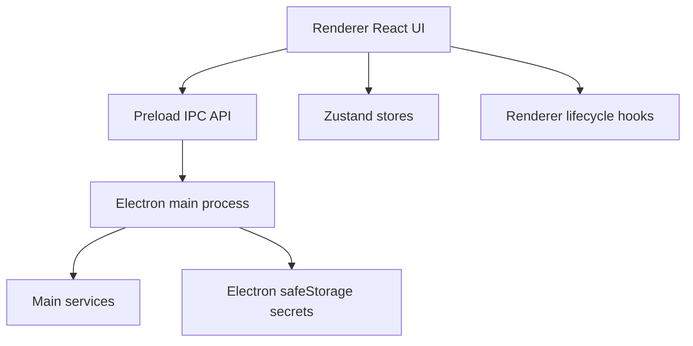

# Refactor Architecture Guide

This branch keeps Electron + React + TypeScript, but moves the app toward explicit service, hook, and store boundaries.

## Process Boundaries



## Main Process

- `src/main/shortcuts.ts`: IPC/global shortcut wiring only; window behavior and AI lifecycle live in services.
- `src/main/services/window-controller.ts`: window visibility, movement, mouse passthrough, and dock behavior helpers.
- `src/main/services/stream-manager.ts`: owns abortable AI streaming lifecycle.
- `src/main/services/ai-conversation-service.ts`: owns screenshot/follow-up conversation state.
- `src/main/services/interview-coach-service.ts`: consumes finalized ASR sentences, updates coach state, and triggers translation.
- `src/main/services/secure-settings-store.ts`: stores API secrets through Electron `safeStorage`; renderer localStorage should not persist API keys.
- `src/main/ipc-contracts.ts`: runtime IPC payload validation.

## Renderer UI

- `src/renderer/src/App.tsx`: route shell plus app-level settings/shortcut startup sync.
- `src/renderer/src/coder/index.tsx`: workbench layout composition only.
- `src/renderer/src/coder/AppContent.tsx`: screenshot timeline and answer rendering.
- `src/renderer/src/coder/AppStatusBar.tsx`: status bar composition only; follow-up state lives in a hook.
- `src/renderer/src/settings/index.tsx`: settings page shell; individual sections live in focused section files.

## Renderer Hooks

- `src/renderer/src/coder/hooks/useTranscriptionController.ts`: transcription start/stop and ASR IPC events.
- `src/renderer/src/coder/hooks/useSolutionEvents.ts`: screenshot, solution, loading, and solution error IPC events.
- `src/renderer/src/coder/hooks/usePageScrollShortcuts.ts`: page up/down shortcut scrolling.
- `src/renderer/src/coder/hooks/useCoderPageState.ts`: coder-page active state and main-process app-state sync.
- `src/renderer/src/coder/hooks/useBodyOpacity.ts`: workbench opacity side effect.
- `src/renderer/src/coder/hooks/useFollowUpQuestion.ts`: follow-up dialog and submit lifecycle.
- `src/renderer/src/coder/hooks/useStatusBarState.ts`: derived status-bar state and stop-generation command.

## Shared Metadata and Domain Code

- `src/shared/interview-coach.ts`: pure interview-coach domain model and heuristic analysis.
- `src/shared/languages.ts`: supported language options shared by renderer selects and main IPC validation.
- `src/renderer/src/lib/shortcut-metadata.ts`: shortcut display metadata shared by Settings and Help.

## Store Guidelines

Zustand stores expose focused selector hooks so components subscribe only to the state they render:

- `src/renderer/src/lib/store/settings.ts`: focused settings selectors and secret-safe persistence partialization.
- `src/renderer/src/lib/store/solution.ts`: solution content/actions/status selectors.
- `src/renderer/src/lib/store/transcription.ts`: transcription bar, coach panel, and controller selectors.
- `src/renderer/src/lib/store/app.ts`: app-state selectors.
- `src/renderer/src/lib/store/shortcuts.ts`: shortcut and shortcut-action selectors.

Avoid calling whole-store hooks in UI components unless the component genuinely needs the full state object.

## Verification Entry Points

Use `docs/local-verification.md` for manual regression. The two basic gates for every checkpoint are:

```bash
npm run typecheck
npm run build
```

Automated unit tests cover the pure-logic modules (no Electron/DOM runtime needed):

```bash
npm run test        # one-shot
npm run test:watch  # watch mode
```

Current coverage: interview-coach transcript analysis (`src/shared/interview-coach.ts`),
language code guards (`src/shared/languages.ts`), IPC contract validation
(`src/main/ipc-contracts.ts`), and keyboard accelerator parsing
(`src/renderer/src/lib/utils/keyboard.ts`). Test files live in `test/`.

For UI work, also run:

```bash
npm run dev
```

Then verify screenshot capture, follow-up questions, shortcut display/edit/reset, settings persistence, ASR single/dual source, translation, and secret-storage checks.
